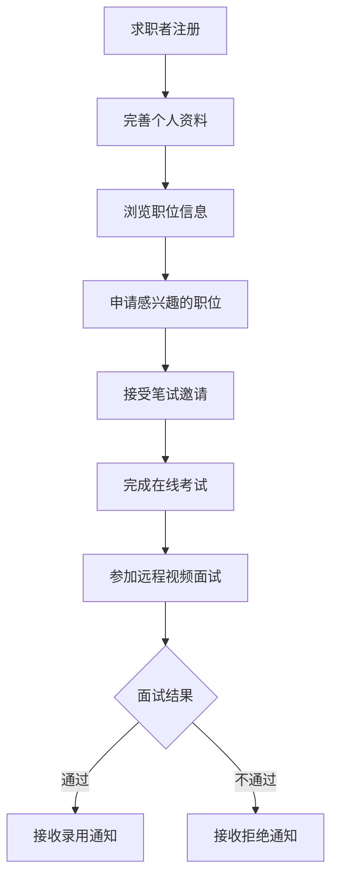
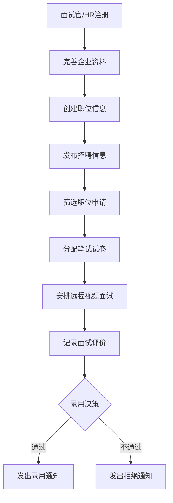
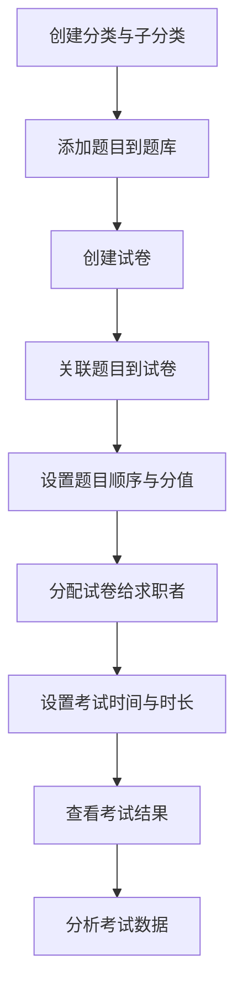

# 在线面试平台 - 云面官 系统设计与实现文档

## 1. 项目概述

"云面官"是一个全面的在线面试与考试平台，面向个人用户和企业用户，提供了一体化的招聘、考试和面试解决方案。系统集成了试卷管理、在线考试、职位招聘、求职申请、面试安排等功能，旨在优化传统招聘流程，提高人才筛选效率。

### 1.1 系统定位

本系统定位为一站式招聘与考试平台，主要服务于两类用户：
- **企业用户**：作为面试官/HR角色，可发布职位、管理简历、安排面试、创建专属考试等
- **个人用户**：作为求职者角色，可浏览职位、投递简历、参加在线考试、安排面试等

### 1.2 核心功能模块

- **考试系统**：支持试卷管理、题库管理、在线考试、成绩分析等
- **招聘系统**：支持公司管理、职位发布、简历投递、招聘流程管理等
- **面试系统**：支持面试安排、面试评价、面试反馈等
- **用户系统**：支持用户注册、登录、资料管理等


## 2. 技术架构设计

### 2.1 整体架构

系统采用现代化的前后端分离架构设计，包含以下关键组件：

1. **前端系统**：
   - 求职者/面试官前端应用
   - 管理员后台系统

2. **后端系统**：
   - RESTful API服务
   - 数据库访问层
   - 业务逻辑层
   - 中间件服务层
   - WebRTC信令服务

3. **数据存储**：
   - 关系型数据库 (MySQL)
   - 缓存数据库 (Redis)

4. **辅助服务**：
   - 邮件服务
   - 文件存储服务
   - 实时通讯服务


### 2.2 技术栈详情

#### 2.2.1 前端技术栈

| 技术 | 版本 | 用途 |
|------|------|------|
| Vue | 3.5 | 前端核心框架，基于Composition API |
| Vue Router | 4.5 | 前端路由管理 |
| Pinia | 3.0 | 状态管理解决方案 |
| Element Plus | 2.9 | UI组件库 |
| Axios | - | HTTP请求客户端 |
| Vite | 6.2 | 构建工具 |
| Less | 4.3 | CSS预处理器 |
| Tailwind CSS | 4.1 | 原子化CSS框架 |
| ECharts | 5.6 | 数据可视化图表 |
| Lodash-es | - | 实用工具库 |
| unplugin-auto-import | - | 自动导入API |
| unplugin-vue-components | - | 自动导入组件 |

#### 2.2.2 后端技术栈

| 技术 | 版本 | 用途 |
|------|------|------|
| NestJS | 10.0 | 后端核心框架 |
| Prisma | 6.6 | ORM数据库映射工具 |
| MySQL | 8.0+ | 关系型数据库 |
| Redis | 4.7 | 缓存数据库 |
| Socket.IO | - | WebSocket实时通讯 |
| WebRTC | - | 点对点音视频通讯 |
| svg-captcha | - | 验证码生成 |
| Nodemailer | - | 邮件服务 |
| bcryptjs | - | 密码加密 |
| @nestjs/config | - | 环境配置 |
| uuid | - | UUID生成 |
| RxJS | - | 响应式编程库 |

## 3. 数据库设计

系统采用关系型数据库MySQL作为主数据库，通过Prisma ORM进行数据访问。数据库设计围绕以下核心业务实体展开：

### 3.1 用户相关表

1. **AdminUser (管理员用户表)**：
   - 存储后台管理系统用户信息
   - 包含ID、用户名、密码、邮箱、角色等字段

2. **FrontUser (前台用户表)**：
   - 存储系统用户信息，包括求职者和面试官
   - 包含ID、用户名、密码、邮箱、角色等字段
   - 关联多个子表详情

### 3.2 考试系统相关表

1. **Category/SubCategory (试卷分类表)**：
   - 管理试卷和题目的一级分类和二级分类
   - 例如"计算机"下的"前端"、"Java"等

2. **Question (题目表)**：
   - 存储所有考试题目，支持多种题型
   - 包含题目内容、选项、答案、AI解析等

3. **ExamPaper (试卷表)**：
   - 存储考试试卷信息
   - 关联题目表，支持公开与私有模式

4. **ExamQuestion (试卷题目关联表)**：
   - 维护试卷和题目之间的多对多关系
   - 记录题目顺序和分值

5. **Favorite (用户收藏表)**：
   - 记录用户收藏的试卷

### 3.3 招聘系统相关表

1. **JobSeeker (求职者表)**：
   - 存储求职者详细信息
   - 包含工作经历、教育背景等

2. **Company (公司表)**：
   - 存储招聘公司信息
   - 包含公司描述、规模、融资阶段等

3. **Interviewer (面试官表)**：
   - 存储面试官/HR详细信息
   - 关联公司表

4. **IndustryCategory/SubCategory (行业分类表)**：
   - 管理行业的一级分类和二级分类

5. **JobPosting (职位发布表)**：
   - 存储职位招聘信息
   - 包含职位要求、薪资范围、工作地点等

6. **JobApplication (职位申请表)**：
   - 记录求职者申请职位的信息
   - 管理申请状态流转

7. **Interview (面试安排表)**：
   - 记录面试时间和状态
   - 包含面试反馈和评分

8. **ExamAssignment (笔试分配表)**：
   - 记录笔试试卷分配信息
   - 管理在线笔试流程

9. **Notification (消息通知表)**：
   - 系统内各类通知

### 3.4 数据库表关系

系统在设计时充分考虑了各实体间的关系：

- **一对一关系**：如用户与求职者/面试官资料
- **一对多关系**：如公司与职位、求职者与工作经历等
- **多对多关系**：如试卷与题目、用户与收藏等


## 4. API接口设计

系统提供了RESTful风格的API接口，主要包括以下几类：

### 4.1 认证接口 (/auth)
- 用户注册、登录
- 验证码生成与验证
- 用户资料获取与更新

### 4.2 考试接口
- 分类管理
- 试卷管理
- 在线考试
- 收藏管理

### 4.3 公司接口 (/company)
- 公司信息管理
- 公司验证

### 4.4 行业接口 (/industry)
- 行业分类管理

### 4.5 面试接口 (/interview)
- 面试安排
- 远程视频面试
- 面试评价

### 4.6 职位接口 (/job)
- 职位发布与管理
- 职位申请

### 4.7 求职者接口 (/jobseeker)
- 资料管理
- 教育与工作经历管理
- 申请记录查询

### 4.8 上传接口 (/upload)
- 简历上传

### 4.9 辅助服务接口
- 邮件发送
- 缓存管理

完整API文档可通过系统的Swagger界面访问：`/api/docs`

## 5. 系统业务流程

### 5.1 求职流程



### 5.2 招聘流程



### 5.3 考试管理流程



## 6. 实现特色与技术亮点

### 6.1 技术亮点

1. **现代化前端架构**：
   - 采用Vue 3 Composition API提高代码复用性和可维护性
   - 使用Pinia状态管理方案，替代传统Vuex
   - 结合Tailwind CSS实现高效率UI开发

2. **高性能后端设计**：
   - 基于NestJS框架，实现模块化、可测试的后端应用
   - 结合Prisma ORM，提供类型安全的数据库访问
   - 使用Redis缓存提升系统响应速度

3. **实时视频通讯**：
   - 基于WebRTC技术实现浏览器端点对点音视频通讯
   - 使用Socket.IO实现信令服务器，支持实时通讯
   - 支持屏幕共享、音视频控制等核心功能
   - 优化网络自适应技术，确保不同网络条件下的视频质量

4. **安全性考虑**：
   - 密码加密存储
   - 邮箱验证码登录
   - 图形验证码防护
   - JWT身份验证
   - 视频面试邀请码验证机制

### 6.2 功能特色

1. **智能面试体系**：
   - 一站式的招聘流程管理
   - 多轮面试支持(一面、二面、HR面)
   - 实时远程视频面试功能，支持多轮面试远程进行
   - 面试评价与反馈机制

2. **灵活的考试系统**：
   - 多种题型支持(单选、多选、判断、填空)
   - AI解析功能
   - 自定义试卷与题目排序
   - 笔试邀请与截止管理

3. **完整的求职管理**：
   - 简历上传与管理
   - 教育与工作经历记录
   - 申请状态追踪

## 7. 系统界面展示

### 7.1 前台界面

| 模块 | 功能描述 |
|------|----------|
|  | 用户登录与注册界面 |
|  | 职位搜索与筛选界面 |
|  | 在线笔试答题界面 |
|  | 实时远程视频面试界面 |
|  | 用户个人资料管理 |

### 7.2 后台界面

| 模块 | 功能描述 |
|------|----------|
|  | 管理员控制台概览 |
|  | 试卷创建与管理界面 |
|  | 招聘流程管理界面 |
|  | 系统数据统计与分析 |

## 8. 部署与运维

### 8.1 系统要求
- Node.js: 18.x 或 20.x
- Redis: 3.0+
- MySQL: 8.0+

### 8.2 部署流程

前端系统:
```bash
# 安装依赖
npm install
# 生产环境构建
npm run build
# 部署到Web服务器
cp -r dist/* /var/www/html/
```

后端系统:
```bash
# 安装依赖
npm install
# 初始化数据库
npx prisma migrate dev
# 生成Prisma客户端
npx prisma generate
# 启动应用
npm run start:dev
```

### 8.3 性能优化措施

1. **前端优化**：
   - 路由懒加载
   - 组件按需引入
   - 静态资源CDN加速
   - 图片懒加载

2. **后端优化**：
   - API响应缓存
   - 数据库索引优化
   - 分页查询实现
   - 定时清理无效数据

## 9. 总结与展望

"云面官"在线面试平台是一个功能完善的招聘与考试系统，通过前后端分离架构实现了高效的用户体验和系统性能。系统整合了求职、招聘、考试、面试等多个环节，为企业和求职者提供了一站式解决方案。

### 9.1 创新点总结

1. 将传统招聘流程数字化，实现全流程在线管理
2. 整合考试系统与招聘系统，提高筛选效率
3. 引入多轮面试机制，规范化面试流程
4. 采用现代化技术架构，保障系统扩展性

### 9.2 未来发展方向

1. **AI技术应用**：
   - 智能简历筛选
   - 智能面试评估
   - 职位匹配推荐

2. **功能扩展**：
   - 移动端应用开发
   - 社交网络集成

3. **数据应用**：
   - 招聘大数据分析
   - 人才画像系统
   - 职业发展指导

4. **生态建设**：
   - 开放API接口
   - 实现与企业HR系统集成
   - 构建人才生态平台

---